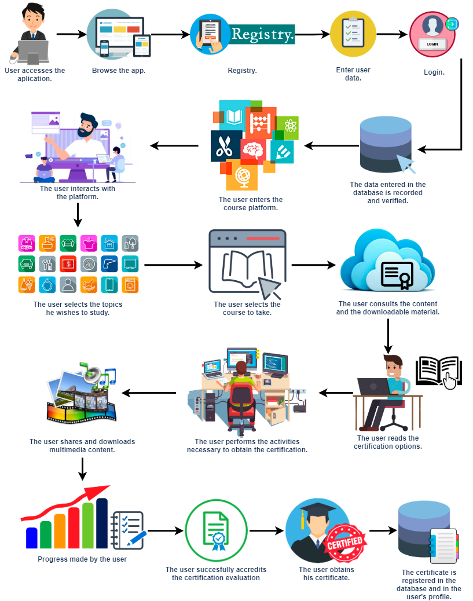

✏️ ***Development***
---
1. Based on the characteristics referred to the case study and the *design thinking proposal*, elaborate a list of at least 
**15 questions headed to the client** that can give them detailed information to elaborate the requirements analysis about the case study.
2. Once the interview was indicated in the last point has been made, use any of the techniques that are proposed inside the *empathize* phase of the design thinking. You can also use any other tool. Technique or artifact to consolidate the collected information through the client and elaborate your **system developing business model proposal**.
3. Elaborate and present your document, considering the making of a dynamic, just as a work would be done on field or on client’s location. And present the work to your consultant and your classmates.

---
   **Context diagram.**
   

    

   
---
   **Interview.**

**• Would you like the platform to have different types of user accounts or will always have the standard user?**
*I would like it to be for different types of users, (for the people who develop the courses, for those who give the training, and for those who will receive the training).*

**• What security methods would you want to implement for the user accounts to be secure?**
*User and password (with recovery by alternate mail in case of forgetting it).*

**• Would you like that all types of users to be able to enter and interact with the platform or would he need an account?**
*Only those users who have a registered username and password.*

**• How would you like the design of the platform to be?**
*Minimalist, so that user access may not be complicated.*

**• What kind of certifications and courses would you like to implement?**
*Basics (which all employees must take), technical, operational, specialized and practical (The latter being not an exam but rather an observational one, users must go to their coordinator to be given "the go-ahead"); They are registered manually using excel and the more progress is made in the courses or in their position, more will be added, but these have a one-year expiration, in case of losing it, it must be retaken, and if the course is updated (in case it’s something minor, it’s not necessary), also this update must have a review.*

**• Within the catalog, what information would you like to  display of each course?**
*Who is the course type for, the information expected to be found in the course, and the most current review of the course.*

**• How would you like the courses to be divided within the catalog?**
*I would like them to be according to the category of each role or profile.*

**• What would you like the forms of payment to be for the registration?**
*With credit and debit cards, with paypal as optional.*

**• At any point, do you ever make videos or presentations? And, in what kind of material do you create them?**
*Yes, sometimes we record videos but they are not very heavy, and we do presentations mostly in powerpoint.*

**• Would you like the user to be shown the percentage of the course that is being achieved from the beginning to finish?**
*Definitely yes, so that he knows how much of the course is still missing.*

**• Will the user be able to take the final certification exam / activity as many times as they want until their approval or will they have a limit of attempts?**
*No, in case of failing the exam, the course must be restarted in order to pass it.*

**• Will the courses have scheduled activities or will it be completely self-taught and at the pace that the user wishes?**
*Scheduled, but it may vary depending on the course. Users have a structured training matrix marking the course taken (but they do not depend on any others). This user can take more than one course and even take 2 exams (the exams last around 30 min and is written). However, there must also be a special person (area supervisor) who is dedicated to reviewing the content of their coaches for approval.*

**• At the end of a course (with a successful evaluation), what kind of information or document would you like to be presented to the user?**
*I would like to be able to print a document, card or credential as proof of certification, which are currently the small yellow sheets that the employee brings that are next to the credential to make it easier to read if the person is certified with these courses, it's mostly visual.*

**• Would you like the certificate to be generated automatically upon successful completion of the course, or for the certification to be delivered after a defined time?**
*At the end of the course.*

**• What information about the courses would you like to see shown to the institution? (Ex. Most requested courses, percentage of users who completed the courses, etc.)**
*I would like it to be the most requested courses, the outdated courses, and which users will have the course expired.*

**• How far in advance would you like to be notified that your certification is about to expire?**
*15 days in advance for them to be able to speak with the program coordinator.*

---

 **Requeriments**

   1. Each kind of user will have their own account to enter the platform with a password.
   2. The user will have the option of recovering their password by email.
   3. The design of the platform has to be minimalist so that the user does not have any complications navigating it.
   4. The certifications and courses that will be implemented within the platform will be of the basic, technical, operational and practical kind.
   5. Each course / certification will have a one-year expiration, and in case of losing it, it must be retaken from the beginning.
   6.  The course catalog may be divided according to the category of each role or user profile, adapting to their position.
   7.  The payment method will be through debit / credit card, and paypal as an optional method.
   8.  Videos and PowerPoint presentations can be uploaded to the platform.
   9.  The user will be able to see the percentage of each course / certification they are taking.
   10. In case of failing a course / certification, you must restart it in order to pass it.
   11. The activities of each course / certification will be scheduled.
   12. Each course will need to be reviewed by an area supervisor before adding it.
   13. With the approval of any course / certification a document will be generated which can be printed as proof.
   14. The institution may receive information on the most requested courses, obsolete courses, and which users will have the course expired.
   15. In the event that any course / certification is about to expire, the user will be notified within a period of 15 days to be able to communicate with the coordinator of the course / certification.
---

   **Method: What?/ How?/ Why?**
   
|What?  (What does it take to develop it?) | How?   (How is it going to develop?)|Why?   (Why does it develop that way?)|
|---|---|---|
|Each user will have a password to enter the platform.| Through an account register. | To increase site security. |
| Users need to recover their accounts. | Message to email. | You need to have an account recovery method. |
| The platform must have a minimalist design. | Through front end programming. | To make it more intuitive for the user. |
| Create courses with different branches of application. | Implemented various types of course (basic, technical, operational and practical). | There must be a variety for the user. |
| Courses and certificates must have an expiration date. | Creating a deadline. | For the user to visualize their times. |
| There will be diversification of special courses for each role. | Divided according to categories or work plans. | So the user will find the one that suits him best. |
| There must be a payment method to access the courses. | By credit / debit card and Paypal as an optional method. | They are the safest methods of payment. |
| For courses, you need multimedia content to teach. | For this, it will be allowed to upload videos and digital presentations. | Versatility and understanding for the user are increased. |
| The user needs to see how much progress is in their courses at all times. | A percentage of progress will be displayed. | So the user can be aware of their progress in a specific way. |
| In case of failing the course, the user must restart it. | Restart the course. | For the user to reinforce knowledge again. |
| The courses must have a schedule. | This is accomplished through scheduling the courses. | The user must commit to taking the courses. |
| The courses must be supervised. | A course supervisor will be assigned for each existing area in the courses.  | There must be an order and that the quality of the courses offered be maintained. |
| When the user accredits a course, an accreditation document must be shown | A document can be printed proving the completion of the user's course. | The user must have proof of accreditation. |
| The institution should see the most requested courses, the most obsolete and the general progress of users. | You will be able to see statistics directly of the courses and the progress of the users. | So that the institution has a more direct control of the courses. |
| Users will be given a notice when their certificate is about to expire. | This will be by notice of the platform and the document will  expire in 15 days. | The user must be aware of the deadline for the acquisition of his certificate. |

---
   **Conclutions**
* **Chavez Lopez Eduardo Guillermo:**
  The most difficult part was the development of the requirements since all the requirements had to be deduced and defined from the questions presented in class, in addition to that, we had to define a method to empathize with the client, which although not it was difficult to carry out, if it was very laborious to implement, since each requirement had to be verified to be compatible with the type of method implemented; But not everything was so bad, I learned many things, such as the way to address the client (at least in this interview) and the way to write the questions, adding to this, I understood Design thinking a little more.
   

* **Dominguez Cervantes Daniel Ivan:**  
  In conclusion, in the interview it was possible to obtain the necessary data to be able to define the requirements that were somewhat complicated to write since some were not fully understood, which took us certain to finish them. We chose the method because we concluded among all that it was the one that best suits our case study, the complicated thing was at the time of implementing it with the requirements that we elaborated and with this method we could better understand the requirements of the case of study.
   

* **Flores Aguila David Antonio:**
  The most significant learning I acquired during this research work was trying to adapt our case study to the method of the empathize phase of **Design Thinking**, I had to investigate and compare several examples that I could find on the internet, identify key points and understand them as well as possible, which was a bit complicated because the examples I used as reference were from very different cases from our team, but in the end after discussing the examples among ourselves, we were able to establish the foundations of our work and be able to do it in the most approximate way to what the job requires.
   

 * **Valadez Camacho Gustavo:** 
  The making of the interview is essential to learn more about the requirements that are sought in the platform, since all the functions that are desired are specified here. With the What, How, and Why method, we were able to interpret better the needs of the company so that the platform can satisfy them. Although it is somewhat laborious, it does allow us to understand each requirement in more detail.
   

* **Vazquez Osuna Laura Michelle:**
  Data collection isn’t easy, we must ask a question that is open enough so that the client can be free to express what they want, but this should not be extended since the client will not know what to answer or it could be very ambiguous, but it cannot be so specific because we would not have enough information to meet our requirements. There were many doubts that points mentioned in the interview should be in the requirements, many doubts came up and then our ideas were mixed, until we finally agreed on the completion of the work
   
---

💣 ***Rubric***
---
|Criteria|Description|Score|
|---|---|---|
|Instructions|Are each one of the points indicated in the Instructions section fulfilled?  |10|
|Development|Were each of the requested points answered inside the activity’s development? |60|
|Demonstration|Does the student introduce himself during the explanation of the functionality of the activity? |20|
|Conclusions|Is a personal opinion about the activity included by each of the team members? |10|

:open_file_folder: [Github](https://github.com/daivandz/Analisis-Avanzado-de-Software)

:house: [Ir a inicio](/README.md "índice") 