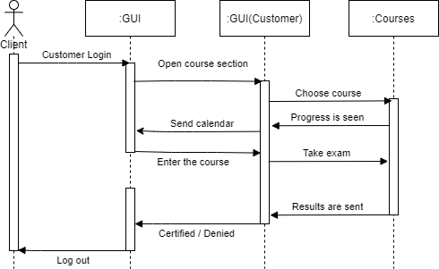

### :pencil2: Development

1. Based on each of the user and system requirements previously established for the case study, write the requested modeling diagrams:

+ A diagram that contains the relationships between the different use cases, only for the scenario in which the user interacts with the system using the main or central functions according to each case study. (Include at least 5 elements of the diagram)

+ The **sequence** diagram that explains the communication between the different GUIs for the use cases of the previous point, considering that the user has already successfully entered the system. (Include at least 5 elements of the diagram)

+ The **class** diagrams for the objects to be instantiated, for the aforementioned points. (Include at least 5 elements of the diagram)

+ A package diagram containing the **component** diagrams and the relationships between the database, user interfaces, controllers, or middle layers - middleware. (Include at least 3 elements of the diagram)

+ The **distribution** diagrams representing the physical structure of the system such as physical infrastructure, networks, storage servers and web, firewall, mobile devices or any other physical resource that will be part of the system. (Include at least 3 elements of the diagram)

##Use Cases Diagram

##Sequence Diagram

##Class Diagram

##Component Diagram

##Distribution Diagram

## :books: Conclusions 

|Name|Conclusion|
|---|---|
|**Chavez Lopez Eduardo Guillermo**|These diagrams are a pillar for the understanding of the project, since they lay the foundations for its development and its complete understanding, without these diagrams, the monitoring of the project would be almost impossible and could lead to major failures in the course of its development. hence its importance, since it encourages the understanding of people outside the project and establishes better communication between developers and clients.|
|**Dominguez Cervantes Daniel Ivan**|The diagrams are a fundamental part of the project, since it shows how the program to be carried out is going to be organized, from the different users that it will have, as well as the different activities that each one can carry out within the program, also how the program interacts with both the software and the hardware, so the different diagrams of each of the team members were reviewed and compared to choose those that met the necessary requirements.|
|**Flores Aguila David Antonio**|With each task we do as a team, I feel that making diagrams is no longer so complicated for me, that although it is not the most difficult thing in the world, it is not my favorite activity either. Certainly comparing my colleagues' work to mine gives me a little more confidence in my own diagramming abilities. Something negative I might add is that because this work was not reviewed for us, we had to rely on our judgment and choose which ones we thought were best, so we hope we don't make a mistake with our choices.|
|**Valadez Camacho Gustavo**|With these diagrams it is intended to be able to detail the functions that the platform will provide, in a clearer way for those who wish to know them, either to the people to whom the project is being presented, or people within the organization who need to know a little more in detail the platform infrastructure.|
|**Vazquez Osuna Laura Michelle**|During the making and choosing of diagrams for the entire team, we agreed to choose these diagrams, since according to the analysis of the activity, they are the best option to develop our program in this way.|

___

### :bomb: Rubric
 
| Criteria     | Description                                                                                  | Score |
| ------------- | -------------------------------------------------------------------------------------------- | ------- |
| Instructions | Are each one of the points indicated in the Instructions section fulfilled?  | 10 |
| Development    | Were each of the requested points answered inside the activity’s development?     | 60  |
| Demonstration| Is the student present during the explanation of the functionality of the activity?   | 20 |
| Conclusions   |A personal opinion of the activity is included for each of the members of the team?  | 10  |
 
 
:open_file_folder: [Github](https://github.com/daivandz/Analisis-Avanzado-de-Software)

:house: [Home](/README.md "Home")