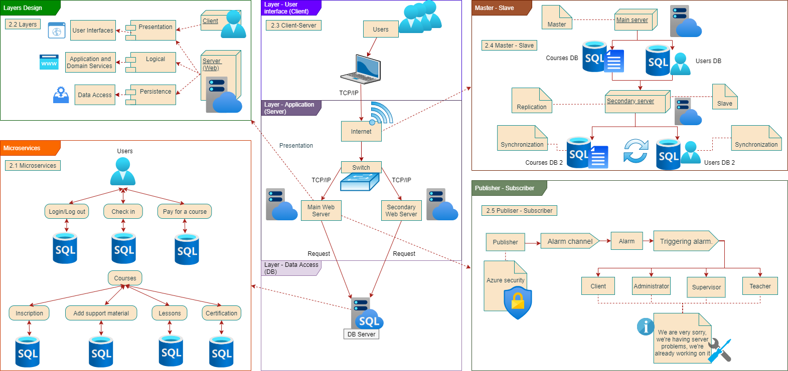

# Introduction
---

## :trophy: A2.3 Learning activity
Software architecture patterns.

---
## :pencil2: Development

**1. Consider applying the following architecture patterns to the case study.**

- :black_square_button: Client-server architecture pattern
- :black_square_button: Layered architecture pattern
- :black_square_button: Architecture pattern Model view controller
- :black_square_button: Micro-service oriented architecture pattern
- :black_square_button: Architecture pattern Pipes and filters
- :black_square_button: Event-based architecture pattern
- :black_square_button: Repository or blackboard architecture pattern
- :black_square_button: Publisher / Subscriber Architecture Pattern
- :black_square_button: Master-slave architecture pattern
- :black_square_button: Point-to-point architecture pattern

**2. Take as a basis the architectural views as well as the elaborated UML diagrams, to apply the pattern that you consider the most appropriate for each of the following scenarios.**

- 2.1 Considering that it is desired to **maintain and scale the system**, it is sought to develop the application to through the decomposition of small independent and isolated services, which consume a external interface to communicate to a database server.
- 2.2 Being **confidentiality and security** attributes or requirements for the case study, it is seeks to structure each of the components to be programmed into groups of sub-tasks, where each of these sub-tasks must communicate an intermediate layer and this to another layer higher.
- 2.3 Looking for the **availability** of the system, it is proposed to install two service servers, where these make their requests to a third server where the database would be stored.
- 2.4 Identifying that the **integrity** of the data is a requirement, it is proposed to replicate and synchronize the database of data stored within the main server to another, considering the main one as the master and secondary as a slave.
- 2.5 Considering that the client requested that each time a failure occurs, they must provide **alarms** to the different users regardless of the place where they are, it is observed that You must hire a service provider to trigger the alarms and they reach users required.

---

## :books: Conclusions 

|Name|Conclusion|
|---|---|
|**Chavez Lopez Eduardo Guillermo**|The selection of the patterns was particularly difficult since several of the patterns could fit perfectly into our case study, in addition to that we also had to determine how each pattern used would affect the main behavior of our project; It could be said that each decision was key and that the requirements that were requested further adjusted the route of action of our options, but in the end I think we did an excellent job choosing patterns that could behave in a simple and correct way with our case of study.|
|**Dominguez Cervantes Daniel Ivan**|In this activity, it was difficult for us to choose the different patterns that would be used to represent the architectural views that will form our project, because there is a great variety of patterns which can be applied to different scenarios that were proposed for our project. Once the patterns were chosen, the diagrams corresponding to each pattern were made, and by putting them together, the interaction of the user with the application can be appreciated in a broader way.|
|**Flores Aguila David Antonio**|It was quite enriching to be able to work with the architecture patterns, I have worked with design patterns, but not with software architecture patterns. I still don't like having to make diagrams, but at least I feel like I'm better at it every time, and now that the final project will be pure documentation, I think I have to get used to drawing diagrams.|
|**Valadez Camacho Gustavo**|We can demonstrate the operation of the platform in more detail. We did not know some of them by name, however through some projects we had used them in some way.|
|**Vazquez Osuna Laura Michelle**|In this activity I found it very complicated due to the fact of choosing a pattern for the system, putting it to the test of each situation that the teacher staged, the good thing is that thanks to our old activities, we did not have to search among all the tasks which diagrams to use; This delivery also helps us to better structure our project, in such a way that it is easy to create the essential points for a well-executed project.|

---

### :bomb: Rubric

| Criteria     | Description                                                                                  |Score|
| ------------- | -------------------------------------------------------------------------------------------- | ------- |
| Instructions | Are each one of the points indicated in the Instructions section fulfilled?  |10|
| Development    | Were each of the requested points answered inside the activity’s development?     |60|
| Demonstration| Is the student present during the explanation of the functionality of the activity?   |20|
| Conclusions   |A personal opinion of the activity is included for each of the members of the team?  |10|

:open_file_folder: [Github](https://github.com/daivandz/Analisis-Avanzado-de-Software)

:house: [Ir a inicio](/README.md "índice")